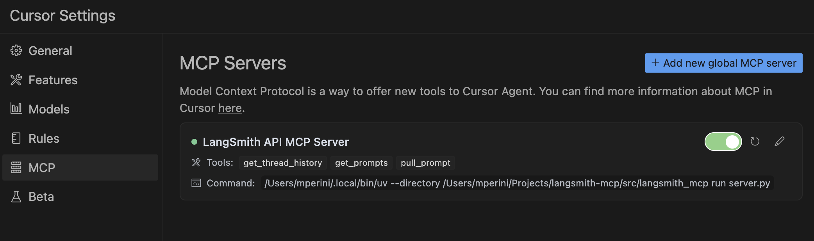

# 🦜🛠️ LangSmith MCP Server


[](https://opensource.org/licenses/MIT)
[](https://www.python.org/downloads/release/python-3100/)

A production-ready [Model Context Protocol](https://modelcontextprotocol.io/introduction) (MCP) server that provides seamless integration with the [LangSmith](https://smith.langchain.com) observability platform. This server enables language models to fetch conversation history, prompts, runs and traces, datasets, experiments, and billing usage from LangSmith.

## 📋 Example Use Cases

The server enables powerful capabilities including:

- 💬 **Conversation History**: "Fetch the history of my conversation from thread 'thread-123' in project 'my-chatbot'" (paginated by character budget)
- 📚 **Prompt Management**: "Get all public prompts in my workspace" / "Pull the template for the 'legal-case-summarizer' prompt"
- 🔍 **Traces & Runs**: "Fetch the latest 10 root runs from project 'alpha'" / "Get all runs for trace &lt;uuid&gt; (page 2 of 5)"
- 📊 **Datasets**: "List datasets of type chat" / "Read examples from dataset 'customer-support-qa'"
- 🧪 **Experiments**: "List experiments for dataset 'my-eval-set' with latency and cost metrics"
- 📈 **Billing**: "Get billing usage for September 2025"

## 🚀 Quickstart

A **hosted version** of the LangSmith MCP Server is available over HTTP-streamable transport, so you can connect without running the server yourself:

- **URL:** `https://langsmith-mcp-server.onrender.com/mcp`
- **Hosting:** [Render](https://render.com), built from this public repo using the project's Dockerfile.

Use it like any HTTP-streamable MCP server: point your client at the URL and send your LangSmith API key in the `LANGSMITH-API-KEY` header. No local install or Docker required.

**Example (Cursor `mcp.json`):**
```json
{
  "mcpServers": {
    "LangSmith MCP (Hosted)": {
      "url": "https://langsmith-mcp-server.onrender.com/mcp",
      "headers": {
        "LANGSMITH-API-KEY": "lsv2_pt_your_api_key_here"
      }
    }
  }
}
```

Optional headers: `LANGSMITH-WORKSPACE-ID`, `LANGSMITH-ENDPOINT` (same as in the [Docker Deployment](#-docker-deployment-http-streamable) section below).

> **Note:** This deployed instance is intended for [LangSmith Cloud](https://smith.langchain.com). If you use a **self-hosted** LangSmith instance, run the server yourself and point it at your endpoint—see the [Docker Deployment](#-docker-deployment-http-streamable) section below.

## 🛠️ Available Tools

The LangSmith MCP Server provides the following tools for integration with LangSmith.

### 💬 Conversation & Threads

| Tool Name | Description |
|-----------|-------------|
| `get_thread_history` | Retrieve message history for a conversation thread. Uses **char-based pagination**: pass `page_number` (1-based), and use returned `total_pages` to request more pages. Optional `max_chars_per_page` and `preview_chars` control page size and long-string truncation. |

### 📚 Prompt Management

| Tool Name | Description |
|-----------|-------------|
| `list_prompts` | Fetch prompts from LangSmith with optional filtering by visibility (public/private) and limit. |
| `get_prompt_by_name` | Get a specific prompt by its exact name, returning the prompt details and template. |
| `push_prompt` | Documentation-only: how to create and push prompts to LangSmith. |

### 🔍 Traces & Runs

| Tool Name | Description |
|-----------|-------------|
| `fetch_runs` | Fetch LangSmith runs (traces, tools, chains, etc.) from one or more projects. Supports filters (run_type, error, is_root), FQL (`filter`, `trace_filter`, `tree_filter`), and ordering. When `trace_id` is set, returns **char-based paginated** pages; otherwise returns one batch up to `limit`. Always pass `limit` and `page_number`. |
| `list_projects` | List LangSmith projects with optional filtering by name, dataset, and detail level (simplified vs full). |

### 📊 Datasets & Examples

| Tool Name | Description |
|-----------|-------------|
| `list_datasets` | Fetch datasets with filtering by ID, type, name, name substring, or metadata. |
| `list_examples` | Fetch examples from a dataset by dataset ID/name or example IDs, with filter, metadata, splits, and optional `as_of` version. |
| `read_dataset` | Read a single dataset by ID or name. |
| `read_example` | Read a single example by ID, with optional `as_of` version. |
| `create_dataset` | Documentation-only: how to create datasets in LangSmith. |
| `update_examples` | Documentation-only: how to update dataset examples in LangSmith. |

### 🧪 Experiments & Evaluations

| Tool Name | Description |
|-----------|-------------|
| `list_experiments` | List experiment projects (reference projects) for a dataset. Requires `reference_dataset_id` or `reference_dataset_name`. Returns key metrics (latency, cost, feedback stats). |
| `run_experiment` | Documentation-only: how to run experiments and evaluations in LangSmith. |

### 📈 Usage & Billing

| Tool Name | Description |
|-----------|-------------|
| `get_billing_usage` | Fetch organization billing usage (e.g. trace counts) for a date range. Optional workspace filter; returns metrics with workspace names inline. |

### 📄 Pagination (char-based)

Several tools use **stateless, character-budget pagination** so responses stay within a size limit and work well with LLM clients:

- **Where it’s used:** `get_thread_history` and `fetch_runs` (when `trace_id` is set).
- **Parameters:** You send `page_number` (1-based) on every request. Optional: `max_chars_per_page` (default 25000, cap 30000) and `preview_chars` (truncate long strings with "… (+N chars)").
- **Response:** Each response includes `page_number`, `total_pages`, and the page payload (`result` for messages, `runs` for runs). To get more, call again with `page_number = 2`, then `3`, up to `total_pages`.
- **Why it’s useful:** Pages are built by JSON character count, not item count, so each page fits within a fixed size. No cursor or server-side state—just integer page numbers.

## 🛠️ Installation Options

### 📝 General Prerequisites

1. Install [uv](https://github.com/astral-sh/uv) (a fast Python package installer and resolver):
   ```bash
   curl -LsSf https://astral.sh/uv/install.sh | sh
   ```

2. Clone this repository and navigate to the project directory:
   ```bash
   git clone https://github.com/langchain-ai/langsmith-mcp-server.git
   cd langsmith-mcp-server
   ```

### 🔌 MCP Client Integration

Once you have the LangSmith MCP Server, you can integrate it with various MCP-compatible clients. You have two installation options:

#### 📦 From PyPI

1. Install the package:
   ```bash
   uv run pip install --upgrade langsmith-mcp-server
   ```

2. Add to your client MCP config:
   ```json
   {
       "mcpServers": {
           "LangSmith API MCP Server": {
               "command": "/path/to/uvx",
               "args": [
                   "langsmith-mcp-server"
               ],
               "env": {
                   "LANGSMITH_API_KEY": "your_langsmith_api_key",
                   "LANGSMITH_WORKSPACE_ID": "your_workspace_id",
                   "LANGSMITH_ENDPOINT": "https://api.smith.langchain.com"
               }
           }
       }
   }
   ```

#### ⚙️ From Source

Add the following configuration to your MCP client settings (run from the **project root** so the package is found):

```json
{
    "mcpServers": {
        "LangSmith API MCP Server": {
            "command": "/path/to/uv",
            "args": [
                "--directory",
                "/path/to/langsmith-mcp-server",
                "run",
                "langsmith_mcp_server/server.py"
            ],
            "env": {
                "LANGSMITH_API_KEY": "your_langsmith_api_key",
                "LANGSMITH_WORKSPACE_ID": "your_workspace_id",
                "LANGSMITH_ENDPOINT": "https://api.smith.langchain.com"
            }
        }
    }
}
```

Replace the following placeholders:
- `/path/to/uv`: The absolute path to your uv installation (e.g., `/Users/username/.local/bin/uv`). You can find it with `which uv`.
- `/path/to/langsmith-mcp-server`: The absolute path to the **project root** (the directory containing `pyproject.toml` and `langsmith_mcp_server/`).
- `your_langsmith_api_key`: Your LangSmith API key (required).
- `your_workspace_id`: Your LangSmith workspace ID (optional, for API keys scoped to multiple workspaces).
- `https://api.smith.langchain.com`: The LangSmith API endpoint (optional, defaults to the standard endpoint).

Example configuration (PyPI/uvx):
```json
{
    "mcpServers": {
        "LangSmith API MCP Server": {
            "command": "/path/to/uvx",
            "args": ["langsmith-mcp-server"],
            "env": {
                "LANGSMITH_API_KEY": "lsv2_pt_your_key_here",
                "LANGSMITH_WORKSPACE_ID": "your_workspace_id",
                "LANGSMITH_ENDPOINT": "https://api.smith.langchain.com"
            }
        }
    }
}
```

Copy this configuration into Cursor → MCP Settings (replace `/path/to/uvx` with the output of `which uvx`).



### 🔧 Environment Variables

The LangSmith MCP Server supports the following environment variables:

| Variable | Required | Description | Example |
|----------|----------|-------------|---------|
| `LANGSMITH_API_KEY` | ✅ Yes | Your LangSmith API key for authentication | `lsv2_pt_1234567890` |
| `LANGSMITH_WORKSPACE_ID` | ❌ No | Workspace ID for API keys scoped to multiple workspaces | `your_workspace_id` |
| `LANGSMITH_ENDPOINT` | ❌ No | Custom API endpoint URL (for self-hosted or EU region) | `https://api.smith.langchain.com` |

**Notes:**
- Only `LANGSMITH_API_KEY` is required for basic functionality
- `LANGSMITH_WORKSPACE_ID` is useful when your API key has access to multiple workspaces
- `LANGSMITH_ENDPOINT` allows you to use custom endpoints for self-hosted LangSmith installations or the EU region


## 🐳 Docker Deployment (HTTP-Streamable)

The LangSmith MCP Server can be deployed as an HTTP server using Docker, enabling remote access via the HTTP-streamable protocol.

### Building the Docker Image

```bash
docker build -t langsmith-mcp-server .
```

### Running with Docker

```bash
docker run -p 8000:8000 langsmith-mcp-server
```

The API key is provided via the `LANGSMITH-API-KEY` header when connecting, so no environment variables are required for HTTP-streamable protocol.

### Connecting with HTTP-Streamable Protocol

Once the Docker container is running, you can connect to it using the HTTP-streamable transport. The server accepts authentication via headers:

**Required header:**
- `LANGSMITH-API-KEY`: Your LangSmith API key

**Optional headers:**
- `LANGSMITH-WORKSPACE-ID`: Workspace ID for API keys scoped to multiple workspaces
- `LANGSMITH-ENDPOINT`: Custom endpoint URL (for self-hosted or EU region)

**Example client configuration:**
```python
from mcp import ClientSession
from mcp.client.streamable_http import streamablehttp_client

headers = {
    "LANGSMITH-API-KEY": "lsv2_pt_your_api_key_here",
    # Optional:
    # "LANGSMITH-WORKSPACE-ID": "your_workspace_id",
    # "LANGSMITH-ENDPOINT": "https://api.smith.langchain.com",
}

async with streamablehttp_client("http://localhost:8000/mcp", headers=headers) as (read, write, _):
    async with ClientSession(read, write) as session:
        await session.initialize()
        # Use the session to call tools, list prompts, etc.
```

### Cursor Integration

To add the LangSmith MCP Server to Cursor using HTTP-streamable protocol, add the following to your `mcp.json` configuration file:

```json
{
  "mcpServers": {
    "HTTP-Streamable LangSmith MCP Server": {
      "url": "http://localhost:8000/mcp",
      "headers": {
        "LANGSMITH-API-KEY": "lsv2_pt_your_api_key_here"
      }
    }
  }
}
```

**Optional headers:**
```json
{
  "mcpServers": {
    "HTTP-Streamable LangSmith MCP Server": {
      "url": "http://localhost:8000/mcp",
      "headers": {
        "LANGSMITH-API-KEY": "lsv2_pt_your_api_key_here",
        "LANGSMITH-WORKSPACE-ID": "your_workspace_id",
        "LANGSMITH-ENDPOINT": "https://api.smith.langchain.com"
      }
    }
  }
}
```

Make sure the server is running before connecting Cursor to it.

### Health Check

The server provides a health check endpoint:
```bash
curl http://localhost:8000/health
```

This endpoint does not require authentication and returns `"LangSmith MCP server is running"` when the server is healthy.

## 🧪 Development and Contributing

### Prerequisites

- **Python** 3.10+ (3.11+ recommended)
- **[uv](https://docs.astral.sh/uv/)** – install with `curl -LsSf https://astral.sh/uv/install.sh | sh`
- **LangSmith API key** – from [smith.langchain.com](https://smith.langchain.com)
- **Node.js** (optional) – only if you want to use [MCP Inspector](https://github.com/modelcontextprotocol/inspector) to test the server (stdio or streamable-http)

### Setup

```bash
git clone https://github.com/langchain-ai/langsmith-mcp-server.git
cd langsmith-mcp-server

uv sync                    # Install dependencies
uv sync --group test       # Include test dependencies (pytest, ruff, mypy)

uvx langsmith-mcp-server   # Verify CLI runs (stdio)
```

### Development workflow

1. **Edit code** in `langsmith_mcp_server/` or `tests/`.
2. **Format and lint** (required before committing):
   ```bash
   make format
   make lint
   ```
3. **Run tests**:
   ```bash
   make test
   # Or a single file:
   make test TEST_FILE=tests/tools/test_dataset_tools.py
   ```
4. **Type-check** (optional): `uv run mypy langsmith_mcp_server/`

### Testing with MCP Inspector

You can test the server with [MCP Inspector](https://github.com/modelcontextprotocol/inspector) using either **stdio** or **streamable-http**.

1. **Start MCP Inspector:**
   ```bash
   npx @modelcontextprotocol/inspector@latest
   ```
   Open **http://localhost:6274** in your browser.

2. **Connect** in the Inspector:
   - **Stdio:** Choose stdio transport and configure the server command (e.g. `uv run langsmith-mcp-server`) and set `LANGSMITH_API_KEY` in the environment.
   - **Streamable HTTP:** Start the server first (`uv run uvicorn langsmith_mcp_server.server:app --host 0.0.0.0 --port 8000` or Docker), then choose streamable-http, URL **`http://localhost:8000/mcp`**, and add header **`LANGSMITH-API-KEY`** = your API key.

### Load testing

A **session-based** load test opens many MCP sessions and calls the `list_prompts` tool in each, using [langchain-mcp-adapters](https://github.com/langchain-ai/langchain-mcp-adapters). Run from the CLI (no UI). The server must be running first.

```bash
uv sync --group load
# Terminal 1: start the server
uv run uvicorn langsmith_mcp_server.server:app --host 0.0.0.0 --port 8000
# Terminal 2: run the load test
uv run python tests/load_test_sessions.py --sessions 20 --calls-per-session 3
```

**Options**

| Option | Default | Description |
|--------|---------|-------------|
| `--url` | `http://localhost:8000/mcp` | MCP endpoint URL |
| `--api-key` | from `.env` | `LANGSMITH_API_KEY` (or set in project root `.env`) |
| `--sessions` | 10 | Number of concurrent sessions |
| `--calls-per-session` | 3 | `list_prompts` calls per session |
| `--debug` | off | Print step-by-step logs and first error traceback |
| `--report` PATH | — | Write a report after the run (see below) |

**Report**

Use `--report PATH` to write a JSON report after the test (e.g. `--report load_test_report` creates `load_test_report.json` with config, summary, per-session results, and first error).

```bash
uv run python tests/load_test_sessions.py --sessions 5 --report load_test_report
# Creates: load_test_report.json (in current directory)
```

### Contributing checklist

Before opening a PR:

- [ ] `make format` and `make lint` pass
- [ ] `make test` passes
- [ ] New tools or behavior are documented (e.g. in [CLAUDE.md](CLAUDE.md) if you change architecture or tools)
- [ ] Error handling in tools returns `{"error": "..."}` rather than raising

For more detail (adding tools, code standards, troubleshooting), see **[CLAUDE.md](CLAUDE.md)**.

## 📄 License

This project is distributed under the MIT License. For detailed terms and conditions, please refer to the LICENSE file.


Made with ❤️ by the [LangChain](https://langchain.com) Team
